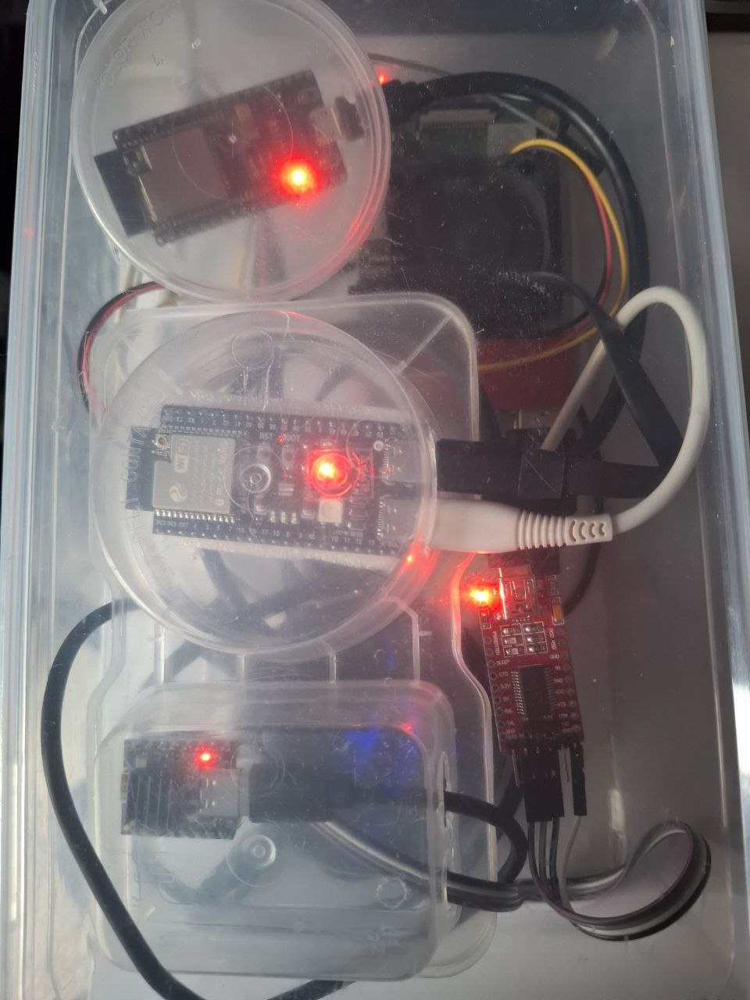

# Rig build: photos and minimum specs

What the reference tester rig actually looks like, and what it takes —
concretely, measured on that hardware — to run all three boards' `--by-board`
lanes concurrently. Wiring per LED is a separate concern: `docs/rig-hardware.md`.

## Photos

The three boards, each in its own small clear tub — keeps bare header pins
from shorting against a neighbor or the case, and makes it obvious at a
glance which enclosure holds which board when you need to unplug one. The red
UART bridge board is the ESP32-C3's (see README "ESP32-C3 serial bridge") —
it needs a second USB port beyond the board's own native USB.

*(More photos welcome — drop additional files in `docs/rig-build/` and add
them here the same way.)*

## Minimum specs to run multiple MCUs concurrently

Reference rig: **Raspberry Pi 3B+** — 4× Cortex-A53, 1GB RAM, Debian 13
(trixie), kernel 6.18. It runs all three boards today via `tester/test-all.sh
--by-board` (one parallel lane per board — see that script's header comment
for why phase 1 is still serialized). Numbers below are pulled from the live
rig, not estimated: `vcgencmd`, `free`, and a `results/health-timeline-*.csv`
sample (`tester/rig-lock.sh`'s sampler) from a real 3-board run.

| Resource | Observed | Verdict |
|---|---|---|
| CPU | load average peaked at 0.95 (of 4 cores) across the whole 3-board run | not the bottleneck, even with 3 concurrent phase-2 pytest+bleak+evdev processes |
| Temp / throttling | 42–44°C at full 1400MHz turbo; `vcgencmd get_throttled` clean (no undervoltage, no throttling) | comfortable |
| RAM | 905MiB total (1GB board, GPU split); ~150–600MiB free during/after a run; zram swap partially in use | the actual constraint — proven, but thin |
| Storage | 14.8GB SD card, 4.1G used (31%) | modest — bundles + results/logs only; PlatformIO's own build cache lives on the **builder**, not this tester |
| USB | 2 built-in hub chips already in use by the Pi's own ports, chained through 2 external hubs to reach all 3 boards | a powered USB hub is effectively required past 1–2 boards |
| BLE | one radio, shared | not a board-count ceiling — see below |

### Reading these numbers

- **1GB RAM is a genuine floor, not a comfort margin.** No OOM kills observed,
  but free memory sits at a few hundred MB under load, with swap already
  partially in use. A board with more headroom (2GB+, e.g. a Pi 4 or Zero
  2W-class board) would give real margin, especially before adding a 4th+
  board — this rig hasn't been tested with more than 3.
- **CPU headroom is generous.** Even a Pi 3B+'s 4 cores are barely troubled
  running 3 boards' phase-2 in parallel. Don't over-spec for CPU here.
- **Budget USB ports per board, not per rig.** Most boards need one; the
  ESP32-C3 needs two (native + bridge — README "ESP32-C3 serial bridge"). The
  Pi's own ports run out fast once a couple of boards are wired — plan on a
  powered hub, not just the onboard ports (also keeps flashing/serial traffic
  from browning out on the Pi's own USB power budget).
- **One shared BLE radio serializes pairing, not the whole run.** `phase1`
  (flash+pair+smoke) deliberately takes the radio one board at a time
  (`tester/test-all.sh`'s `round_barrier`) — a real wall-clock cost as board
  count grows (that barrier's timeout scales with synced-board count for
  exactly this reason), not a hard ceiling on how many boards can share one
  rig.

This is what's proven on the one reference rig above, not an exhaustively
tested minimum — if you try a smaller board (Zero-class) or push past 3
boards, the RAM ceiling is the first thing worth watching
(`free -h` / the `health-timeline-*.csv` sampler already does this for you).
